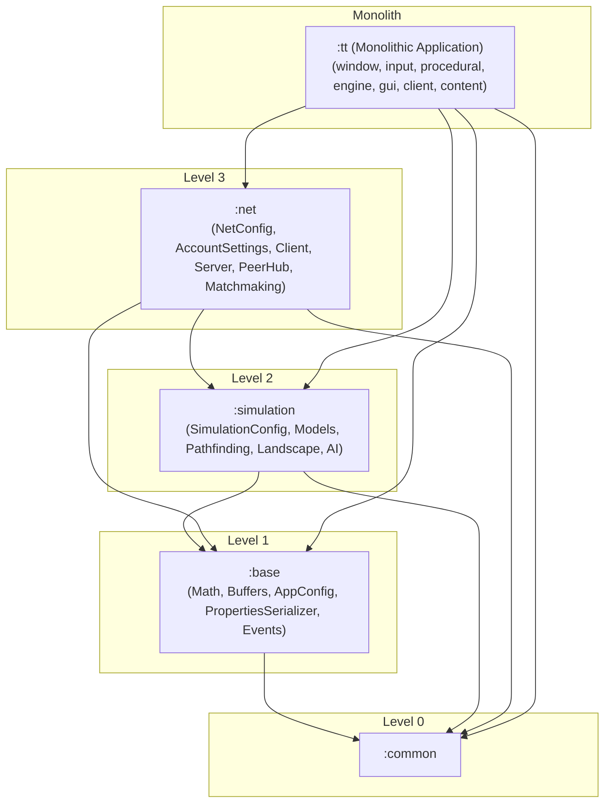

# Requirements

### Overview & Goals
The objective of this task is to execute **Step 3 of the Modularity Roadmap**: isolate and extract the headless networking domain (`com.oddlabs.tt.net`) into an independent Gradle subproject `:net` (Level 3 in the target DAG).

This step isolates network protocols, ARMI RPC event handling, peer connection lifecycle management, matchmaking clients, and router tunnels from the monolithic `:tt` subproject. It also introduces `NetConfig`, decouples net classes from monolithic globals, and relocates `AccountSettings` to `:net` as a self-contained JPMS `PropertiesSerializer` provider.

### Scope

#### In Scope
- **Introduce `NetConfig`:**
  - Create `com.oddlabs.tt.net.NetConfig` containing network constants (`DEFAULT_NET_PORT = 21000`, `checksum_error_in_last_game` tracking flag).
- **Decouple Net Classes from Monolithic Globals:**
  - Update `Client.java` and `Server.java` to reference `NetConfig.DEFAULT_NET_PORT` instead of `Globals.NET_PORT`.
  - Update `MatchmakingClient.java` to reference `AppConfig.REVISION` instead of `Globals.REVISION`.
  - Update `PeerHub.java` to set `NetConfig.checksum_error_in_last_game = true`.
  - Update `Globals.java` to delegate `NET_PORT` and `checksum_error_in_last_game` to `NetConfig`.
- **Relocate `AccountSettings` to `:net` and `SettingsHelper` to `:base`:**
  - Move `SettingsHelper.java` from `com.oddlabs.tt.settings` to `com.oddlabs.tt.base.global.SettingsHelper` so all modular settings slices have access to property parsing helpers.
  - Move `AccountSettings.java` from `com.oddlabs.tt.settings` to `com.oddlabs.tt.net.AccountSettings`.
  - Update `Settings.java` in `:tt` to reference `com.oddlabs.tt.net.AccountSettings`.
  - Declare `provides com.oddlabs.tt.base.global.PropertiesSerializer with com.oddlabs.tt.net.AccountSettings;` in `net/src/main/java/module-info.java`.
  - Remove `AccountSettings` provider declaration from `tt/src/main/java/module-info.java`.
- **Create `:net` Subproject:**
  - Create `net/build.gradle.kts` declaring `java-library` plugin with dependencies on `:simulation`, `:base`, `:common`, `libs.joml`, `libs.jspecify`, and JUnit test dependencies from `gradle/libs.versions.toml`.
  - Create `net/src/main/java/module-info.java` exporting `com.oddlabs.tt.net` and requiring `:simulation`, `:base`, `:common`, `org.joml`, and `org.jspecify`.
  - Relocate `tt/src/main/java/com/oddlabs/tt/net/**` to `net/src/main/java/com/oddlabs/tt/net/**` using `git mv`.
  - Ensure `package-info.java` in `com.oddlabs.tt.net` has concise summary Javadoc and JSpecify nullability compliance.
- **Integrate with Root Build and `:tt`:**
  - Add `include("net")` in `settings.gradle.kts`.
  - Add `implementation(project(":net"))` in `tt/build.gradle.kts`.
  - Update `tt/src/main/java/module-info.java` with `requires com.oddlabs.tt.net;`.

#### Out of Scope
- Extracting `:window`, `:input`, `:procedural`, `:audio`, or `:engine` (subsequent steps in the modularity roadmap).
- Modifying ARMI serialization logic, packet formats, matchmaking protocol, or peer synchronization algorithms.

### User Stories
- **As a Developer,** I want `:net` to be an independent headless subproject so that game server infrastructure and network protocols can be developed, tested, and run headlessly without rendering or windowing dependencies.
- **As a Developer,** I want network configuration and account credential persistence encapsulated in `:net` via JPMS `ServiceLoader` SPI without leaking into monolithic settings.

### Functional Requirements
- Network client/server connections, matchmaking login, peer-to-peer event routing, game argument serialization, and disconnect handling must operate with 100% behavioral parity.
- Account settings persistence (`username`, `pw_digest`, `remember_login`) must continue to load and save seamlessly via `Settings` and `PropertiesSerializer`.

### Non-Functional Requirements
- **Strict Headless Isolation:** `:net` must have zero compile-time or runtime dependencies on LWJGL, OpenGL, SDL, or OpenAL.
- **JPMS Compliance:** Clean module descriptor exporting all public APIs without split-package conflicts.
- **Modern Java 26 Standards:** JSpecify nullability annotations, immutability where applicable, and concise Javadoc summary comments across all classes and packages.

# Technical Design

### Current Implementation
- `com.oddlabs.tt.net` resides within `tt/src/main/java/com/oddlabs/tt/net/` containing 40 classes.
- `Client.java`, `MatchmakingClient.java`, `PeerHub.java`, and `Server.java` have references to `com.oddlabs.tt.Globals`.
- `AccountSettings.java` currently resides in `com.oddlabs.tt.settings` in `:tt`.
- `net` depends on `com.oddlabs.common` (ARMI, network selectors, matchmaking interfaces), `com.oddlabs.tt.base` (animation, event queue, utils), and `com.oddlabs.tt.simulation` (player slots, units, world generators, player info).

### Key Decisions
1. **Encapsulate Network Configuration in `NetConfig`**:
   - `NetConfig` in package `com.oddlabs.tt.net` acts as the canonical owner of network constants:
     - `DEFAULT_NET_PORT = 21000`
     - `checksum_error_in_last_game = false` (mutable tracking flag)
2. **Relocate `AccountSettings` into `:net`**:
   - `AccountSettings` is owned by `:net` and provided via JPMS `module-info.java`:
     ```java
     provides com.oddlabs.tt.base.global.PropertiesSerializer with com.oddlabs.tt.net.AccountSettings;
     ```
   - `Settings.java` in `:tt` retrieves and holds typed access to `AccountSettings` via `com.oddlabs.tt.net.AccountSettings`.
3. **JPMS Module Architecture**:
   - Module name: `com.oddlabs.tt.net`.
   - Declares `requires transitive com.oddlabs.common;`, `requires transitive com.oddlabs.tt.base;`, `requires transitive com.oddlabs.tt.simulation;`, `requires transitive org.joml;`, and `requires static org.jspecify;`.
   - Exports `com.oddlabs.tt.net`.
4. **Centralized Version Management**:
   - `net/build.gradle.kts` exclusively uses accessors from `gradle/libs.versions.toml` (`libs.joml`, `libs.jspecify`, `libs.junit.*`).

### Proposed Changes

#### 1. `com.oddlabs.tt.net.NetConfig`
```java
package com.oddlabs.tt.net;

import org.jspecify.annotations.NonNull;

/**
 * Networking configuration constants and connection defaults.
 */
public final class NetConfig {
    public static final int DEFAULT_NET_PORT = 21000;

    /**
     * Flag indicating whether a deterministic state checksum mismatch occurred during the last game.
     */
    public static boolean checksum_error_in_last_game = false;

    private NetConfig() {}
}
```

#### 2. `AccountSettings.java` Relocation
- Move from `tt/src/main/java/com/oddlabs/tt/settings/AccountSettings.java` to `net/src/main/java/com/oddlabs/tt/net/AccountSettings.java`.
- Package declared as `package com.oddlabs.tt.net;`.
- Update `Settings.java` in `:tt` to import `com.oddlabs.tt.net.AccountSettings`.

#### 3. Decouple `Client.java`, `Server.java`, `MatchmakingClient.java`, and `PeerHub.java`
- `Client.java`: Replace `Globals.NET_PORT` with `NetConfig.DEFAULT_NET_PORT`.
- `Server.java`: Replace `Globals.NET_PORT` with `NetConfig.DEFAULT_NET_PORT`.
- `MatchmakingClient.java`: Replace `com.oddlabs.tt.Globals.REVISION` with `com.oddlabs.tt.base.global.AppConfig.REVISION`.
- `PeerHub.java`: Replace `Globals.checksum_error_in_last_game = true;` with `NetConfig.checksum_error_in_last_game = true;`.
- `Globals.java`: Delegate `NET_PORT = NetConfig.DEFAULT_NET_PORT;` and update `checksum_error_in_last_game`.

#### 4. `net/build.gradle.kts`
```kotlin
plugins {
    `java-library`
}

dependencies {
    api(project(":simulation"))
    api(project(":base"))
    api(project(":common"))
    api(libs.joml)
    api(libs.jspecify)

    testImplementation(platform(libs.junit.bom))
    testImplementation(libs.junit.jupiter)
    testImplementation(libs.junit.jupiter.params)
    testRuntimeOnly(libs.junit.platform.launcher)
}

tasks.withType<Test> {
    useJUnitPlatform()
}
```

#### 5. `net/src/main/java/module-info.java`
```java
module com.oddlabs.tt.net {
    requires transitive com.oddlabs.common;
    requires transitive com.oddlabs.tt.base;
    requires transitive com.oddlabs.tt.simulation;
    requires transitive org.joml;
    requires static org.jspecify;

    exports com.oddlabs.tt.net;

    provides com.oddlabs.tt.base.global.PropertiesSerializer with
            com.oddlabs.tt.net.AccountSettings;
}
```

### Architecture Diagram



### File Structure Changes
- **New Files:**
  - `net/build.gradle.kts`
  - `net/src/main/java/module-info.java`
  - `net/src/main/java/com/oddlabs/tt/net/NetConfig.java`
- **Moved Files (via `git mv`):**
  - `tt/src/main/java/com/oddlabs/tt/settings/SettingsHelper.java` $\rightarrow$ `base/src/main/java/com/oddlabs/tt/base/global/SettingsHelper.java`
  - `tt/src/main/java/com/oddlabs/tt/settings/AccountSettings.java` $\rightarrow$ `net/src/main/java/com/oddlabs/tt/net/AccountSettings.java`
  - `tt/src/main/java/com/oddlabs/tt/net/**` $\rightarrow$ `net/src/main/java/com/oddlabs/tt/net/**`
- **Modified Files:**
  - `settings.gradle.kts`
  - `tt/build.gradle.kts`
  - `tt/src/main/java/module-info.java`
  - `tt/src/main/java/com/oddlabs/tt/Globals.java`
  - `tt/src/main/java/com/oddlabs/tt/settings/Settings.java`
  - `net/src/main/java/com/oddlabs/tt/net/Client.java`
  - `net/src/main/java/com/oddlabs/tt/net/Server.java`
  - `net/src/main/java/com/oddlabs/tt/net/MatchmakingClient.java`
  - `net/src/main/java/com/oddlabs/tt/net/PeerHub.java`

### Risks & Mitigations
- **Split-package JPMS conflict:** Moving all classes from `com.oddlabs.tt.net` into `:net` ensures clean package ownership with no classes in `com.oddlabs.tt.net.*` remaining in `:tt`.
- **PropertiesSerializer Service Discovery:** Moving `AccountSettings` to `:net` and providing it via `:net`'s `module-info.java` ensures JPMS `ServiceLoader` continues discovering and populating account settings in `Settings.java`.

# Testing

### Validation Approach
Verification will be conducted using automated Gradle build tasks, static analysis checks, and runtime smoke testing.

### Key Scenarios
1. **Build & Static Analysis Verification:**
   - Execute `./gradlew check` to verify successful compilation, Error Prone analysis, and NullAway checks across all modules (`:common`, `:base`, `:simulation`, `:net`, `:tt`, `:assets`, `:tools`).
2. **Dependency Boundary Verification:**
   - Execute `./gradlew :net:dependencies` to confirm that `:net` has zero compile-time or runtime dependencies on LWJGL, OpenGL, SDL, or OpenAL.
3. **Runtime Smoke Testing:**
   - Launch `./gradlew :tt:run` in developer mode.
   - Verify that account login credentials load and persist properly.
   - Start a skirmish match or host a LAN game to verify peer initialization and server event distribution.
4. **Code Quality & Formatting:**
   - Execute `./gradlew spotlessCheck` to ensure code formatting adheres to project conventions.
   - Ensure Javadoc summary comments and JSpecify nullability annotations are present across all new and relocated files.

### ✓ Step 1: Introduce NetConfig, relocate SettingsHelper & AccountSettings, and decouple net classes from Globals
- Move `SettingsHelper.java` to `com.oddlabs.tt.base.global.SettingsHelper`.
- Create `com.oddlabs.tt.net.NetConfig` containing `DEFAULT_NET_PORT` and `checksum_error_in_last_game`.
- Move `AccountSettings.java` to `com.oddlabs.tt.net.AccountSettings`.
- Decouple `Client.java`, `Server.java`, `MatchmakingClient.java`, and `PeerHub.java` from `Globals.java` and update `Globals.java` to delegate.
- Update `Settings.java` to import `com.oddlabs.tt.net.AccountSettings`.

### ✓ Step 2: Create net Gradle subproject and JPMS module descriptor
- Create `net/build.gradle.kts` declaring `java-library` plugin with API dependencies on `:simulation`, `:base`, `:common`, `libs.joml`, `libs.jspecify`, and JUnit BOM test dependencies from `gradle/libs.versions.toml`.
- Create `net/src/main/java/module-info.java` requiring `:simulation`, `:base`, `:common`, `org.joml`, and `org.jspecify`, exporting `com.oddlabs.tt.net`, and providing `AccountSettings` as a `PropertiesSerializer`.
- Add `include("net")` to `settings.gradle.kts`.

### ✓ Step 3: Migrate net source tree and package metadata via git mv
- Relocate `tt/src/main/java/com/oddlabs/tt/net/**` to `net/src/main/java/com/oddlabs/tt/net/**` via `git mv`.
- Verify `net/src/main/java/com/oddlabs/tt/net/package-info.java` has summary Javadoc and JSpecify nullability compliance.

### ✓ Step 4: Integrate net with tt and root build, then verify and validate
- Add `implementation(project(":net"))` to `tt/build.gradle.kts`.
- Update `tt/src/main/java/module-info.java` to `requires com.oddlabs.tt.net;` and remove `AccountSettings` from `tt`'s provider list.
- Execute `./gradlew check` to verify compilation, Error Prone analysis, and NullAway checks across all modules.
- Run `./gradlew spotlessCheck` to ensure formatting compliance.
- Run `./gradlew :tt:run` in developer mode to verify matchmaking, account settings persistence, and multiplayer/skirmish initialization.