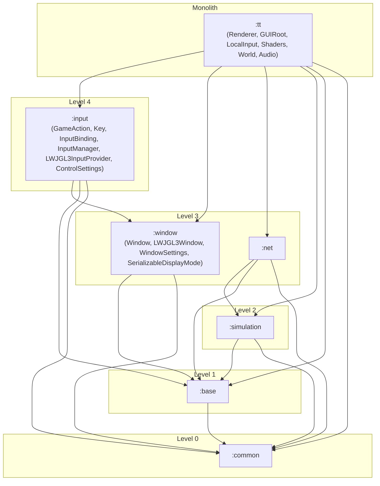

# Requirements

### Overview & Goals
The objective of this task is to execute the next steps in the Tribal Trouble Modularity Roadmap by extracting the window management domain (`com.oddlabs.tt.window`) into `:window` and the input abstraction domain (`com.oddlabs.tt.input`) into `:input`.

### Scope

#### In Scope
- **Extract `:window` Subproject:**
  - Relocate `SerializableDisplayMode` from `com.oddlabs.tt.engine.render` to `com.oddlabs.tt.window.SerializableDisplayMode`.
  - Relocate `WindowSettings` from `com.oddlabs.tt.settings` to `com.oddlabs.tt.window.WindowSettings`.
  - Decouple `LWJGL3Window` from direct references to singleton `Renderer.getRenderer()`.
  - Create `window/build.gradle.kts` and `window/src/main/java/module-info.java`.
  - Relocate `com.oddlabs.tt.window` classes to `window/src/main/java/com/oddlabs/tt/window/**` using `git mv`.
  - Provide `WindowSettings` as a JPMS `PropertiesSerializer` service from `:window`.
- **Extract `:input` Subproject:**
  - Relocate `ControlSettings` from `com.oddlabs.tt.settings` to `com.oddlabs.tt.input.ControlSettings`.
  - Move `MouseButton` to `com.oddlabs.tt.input.MouseButton`.
  - Relocate GUI-tied adapter logic (`KeyboardInput`, `PointerInput`) to `com.oddlabs.tt.gui` or decouple from `Renderer`/`GUIRoot`.
  - Create `input/build.gradle.kts` and `input/src/main/java/module-info.java`.
  - Relocate `com.oddlabs.tt.input` classes (`GameAction`, `Key`, `Modifier`, `InputBinding`, `InputEvent`, `InputPhase`, `KeyboardEvent`, `InputProvider`, `LWJGL3InputProvider`, `InputManager`, `ControlSettings`, `MouseButton`) to `input/src/main/java/com/oddlabs/tt/input/**` using `git mv`.
  - Provide `ControlSettings` and `InputManager` as JPMS `PropertiesSerializer` services from `:input`.
- **Integrate with Root and `:tt`:**
  - Update `settings.gradle.kts`, `tt/build.gradle.kts`, and `tt/src/main/java/module-info.java`.

#### Out of Scope
- Modifying SDL event translation mappings, key code enums, or window coordinate handling logic.
- Extracting `:audio`, `:gui`, or `:engine` (subsequent roadmap steps).

# Technical Design

### Module Hierarchy

# Execution Steps

### Step 1: Relocate WindowSettings & SerializableDisplayMode and decouple LWJGL3Window
- Move `WindowSettings.java` to `com.oddlabs.tt.window.WindowSettings`.
- Move `SerializableDisplayMode.java` to `com.oddlabs.tt.window.SerializableDisplayMode`.
- Decouple `LWJGL3Window.java` from `Renderer.getRenderer()`.
- Update all call sites across `:tt`.

### Step 2: Create :window subproject and migrate window sources
- Create `window/build.gradle.kts` and `window/src/main/java/module-info.java`.
- Add `include("window")` to `settings.gradle.kts`.
- Move `tt/src/main/java/com/oddlabs/tt/window/**` to `window/src/main/java/com/oddlabs/tt/window/**` via `git mv`.
- Update `tt/build.gradle.kts` and `tt/src/main/java/module-info.java`.
- Verify build with `./gradlew :tt:build`.

### Step 3: Relocate ControlSettings & MouseButton and decouple input
- Move `ControlSettings.java` to `com.oddlabs.tt.input.ControlSettings`.
- Move `MouseButton.java` to `com.oddlabs.tt.input.MouseButton`.
- Relocate `KeyboardInput.java` and `PointerInput.java` to `com.oddlabs.tt.gui` (as they are GUI-layer input adapters).
- Update all call sites across `:tt`.

### Step 4: Create :input subproject and migrate input sources
- Create `input/build.gradle.kts` and `input/src/main/java/module-info.java`.
- Add `include("input")` to `settings.gradle.kts`.
- Move `tt/src/main/java/com/oddlabs/tt/input/**` to `input/src/main/java/com/oddlabs/tt/input/**` via `git mv`.
- Update `tt/build.gradle.kts` and `tt/src/main/java/module-info.java`.
- Verify build with `./gradlew :tt:build`.
