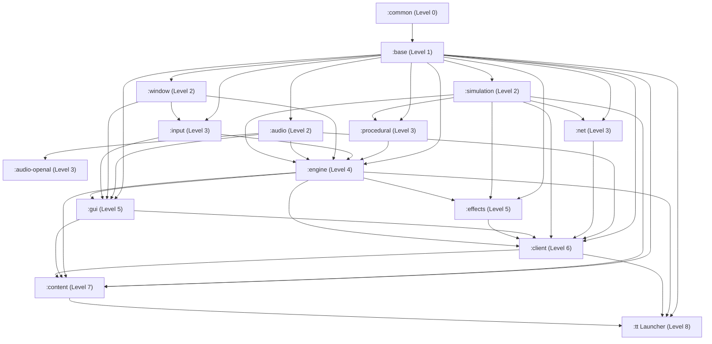

# Requirements

### Overview & Goals
The modularity refactoring has made substantial progress, successfully isolating **8 independent Gradle subprojects and JPMS modules** (`:common`, `:base`, `:simulation`, `:net`, `:window`, `:input`, `:audio`, `:audio-openal`, and `:procedural`) while eliminating major static singletons and circular dependencies.

The goal of this plan is to:
1. Synthesize all architectural findings and discoveries from past extractions.
2. Formulate updates for `docs/modularity_roadmap.md`.
3. Establish the strict, optimal extraction sequence for the remaining subsystems (`:engine`, `:effects`, `:gui`, `:client`, `:content`, and `:tt`).

---

### Scope
- **In Scope:**
  - Incorporating architectural lessons from past steps (`ScopedValue` context injection, SPI properties serializers, CPU vs GPU procedural boundaries, `File<R>` and `NativeResource` consolidation in `:base.resource`).
  - Refining the target DAG and module boundaries for `:engine`, `:effects`, `:gui`, `:client`, and `:content`.
  - Planning the step-by-step delivery order to maintain continuous build greenness (`./gradlew check :tt:build`).
- **Out of Scope:**
  - Modifying gameplay behavior, simulation determinism, or rendering visuals.
  - Rewriting shader pipelines or replacing existing UI widgets.

---

### Key Findings & Architectural Evolution from Past Steps

1. **Java 26 `ScopedValue` for Singleton Elimination:**
   - Rather than relying on global static singletons (`Renderer.getRenderer()`, `LocalInput.getLocalInput()`) or heavy DI frameworks, `ScopedValue` (`AudioManager.CURRENT`, `InputManager.CURRENT`) provides clean, thread-safe, structured context propagation.
   - Resource handles (`AudioFile.get()`) and UI controllers query current context seamlessly without upward compile-time dependencies.

2. **Audio Backend Decoupling (`:audio` vs. `:audio-openal`):**
   - Splitting `:audio` (generic interfaces, `AudioParameters`, `AudioFile`, `AudioSettings`) from `:audio-openal` (OpenAL backend, LWJGL natives) prevents native audio leaks into engine or client modules and enables future alternative backends (e.g. SDL3 audio, MiniAudio, headless null audio).

3. **Procedural Math vs. GPU Texture Generation:**
   - Procedural island generation (`:procedural`) is strictly pure CPU algorithms (`Landscape`, `Midpoint`, `Perlin`, `Voronoi`, `Erosion*`, `GLImage` byte buffers), free of OpenGL constants and GPU textures.
   - Procedural texture generators (`GeneratorClouds`, `GeneratorRock`, etc.) and GPU baking (`LandscapeBaker`) belong in `:engine`.
   - Fog descriptors (`FogInfo`, `DistanceFogInfo`, `RadialFogInfo`) belong in `com.oddlabs.tt.engine.render.state`.

4. **Resource Abstractions in `:base.resource`:**
   - `File<R>` and `NativeResource` live in `:base.resource`, giving all modules a consistent foundation for URI-based asset references and native GPU/OpenAL lifecycle tracking.

5. **`LocalInput` and GUI Decoupling:**
   - `LocalInput` is injected directly into `GUI` and `GUIRoot`, removing static instances and allowing interaction delegates and cameras to query cursor/pointer services through `GUIRoot` and `Window`.

# Technical Design

### Target Subproject Dependency Graph (Acyclic DAG)



---

### Detailed Specification of Remaining Subprojects

 Subproject | Target Package | Responsibility & Contents | Dependencies |
---|---|---|---|
 **`:engine`** (Level 4) | `com.oddlabs.tt.engine` | Core graphics pipeline, GLSL shaders (`ShaderProgram`, `GUIShader`, `ModelShader`, `LandscapeShader`, `InstancedSpriteShader`, `PostProcessShader`, `WaterShader`, `SkyShader`, `GlobalUniforms`), `MatrixStack`, `VBO`, `FBO`, `Texture`, `TextureArray`, `LandscapeResources`, `LandscapeBaker`, `LandscapeRenderer`, `GUIRenderer`, `SpriteRenderer`, `PostProcessor`, `CameraState`, `FogInfo`, `TextureFile`, `SpriteFile`, `FontFile`, procedural texture generators (`Generator*`), `Renderer` singleton, `AccessibilitySettings`. | `:procedural`, `:audio`, `:input`, `:window`, `:net`, `:simulation`, `:base`, `:common` |
 **`:effects`** (Level 5) | `com.oddlabs.tt.effects` | Particle systems (`Emitter`, `LinearEmitter`, `ParametricEmitter`, `Lightning`, `Particle`, `SonicBlastEffect`), visual accessories (`EmitterAccessory`, `PoisonFogVisualAccessory`, `LightningCloudVisualAccessory`), renderers (`EmitterRenderer`, `LightningRenderer`, `SonicBlastRenderer`, `CrackDecalRenderer`). | `:engine`, `:simulation`, `:audio`, `:base`, `:common` |
 **`:gui`** (Level 5) | `com.oddlabs.tt.gui` | Generic 2D UI framework, widgets (`Button`, `TextBox`, `Slider`, `CheckBox`, `EditLine`, `BorderGroup`, `Group`), layout containers (`Horizontal`, `Vertical`), windowing/skinning (`Skin`, `Form`, `FormData`, `Clipped`, `Fade`), `GUIRoot`, `GUI`, `InputDelegate`, `PointerInput`, `KeyboardInput`, `Cursor`, `GUIIcons`, `ModeIcons`. | `:engine`, `:input`, `:window`, `:audio`, `:base`, `:common` |
 **`:client`** (Level 6) | `com.oddlabs.tt.client` | 3D client presentation, `WorldViewer`, camera delegates (`GameCamera`, `FirstPersonCamera`, `MapCamera`, `ControllableCameraDelegate`, `SelectionDelegate`, `TargetDelegate`, `ZoomDelegate`, `PlacingDelegate`), client renderers (`DefaultRenderer`, `ElementRenderer`, `BuildingSiteRenderer`, `PlacingRenderer`, `Picker`), HUD widgets (`ActionButtonPanel`, `ChieftainButton`, `BuildSpinner`, `DeploySpinner`), client game state initialization (`ClientStateInitializer`). | `:gui`, `:effects`, `:engine`, `:audio`, `:window`, `:input`, `:net`, `:simulation`, `:procedural`, `:base`, `:common` |
 **`:content`** (Level 7) | `com.oddlabs.tt.content` | Game content, campaign scenarios (`CampaignScenario`, `LoadCampaignBox`), tutorial scripts (`Tutorial`), menu system (`Menu`, `InGameMainMenu`, `QuitScreen`, `LogoScreen`), settings forms (`GraphicsPanel`, `SoundPanel`, `LanguagePanel`, `KeyBindingPanel`, `CreditsForm`), localization (`Languages`). | `:client`, `:gui`, `:effects`, `:engine`, `:audio`, `:net`, `:simulation`, `:procedural`, `:base`, `:common` |
 **`:tt`** (Level 8) | `com.oddlabs.tt` | Application launcher (`Main.java`), asset packaging, JVM startup configurations, runtime orchestrator. | `:content`, `:client`, `:engine`, `:assets`, `:base`, `:common` |

---

### Remaining Subproject Extraction Sequence

```
Phase 1: Update Modularity Roadmap Documentation
   └── Incorporate all past findings, architectural patterns, and updated DAG into docs/modularity_roadmap.md.

Phase 2: Extract :engine
   └── Move com.oddlabs.tt.engine.**, shaders, textures, render queues, LandscapeBaker, GUIRenderer, Renderer.

Phase 3: Extract :effects
   └── Move com.oddlabs.tt.effects.**, particle emitters, spell visual accessories, and effect renderers.

Phase 4: Extract :gui & Decouple Forms/HUD
   └── Introduce InputDelegate, move game forms/HUD to client/content, extract generic 2D UI toolkit to :gui.

Phase 5: Extract :client & :content
   └── Extract WorldViewer, cameras, delegates, HUD to :client; campaigns, tutorials, menus, settings forms to :content.

Phase 6: Finalize :tt Launcher & Full Project Verification
   └── Trim :tt to Main.java and asset configuration; perform full build check, spotless, and runtime launch.
```

# Testing

### Validation Approach
Each stage in the sequence will be validated using strict compilation, automated testing, static analysis, and runtime verification:

1. **Continuous Build Verification:**
   - After each subproject extraction, execute `./gradlew check` and `./gradlew :tt:build` to guarantee that all modules compile with 0 errors and 0 warnings.

2. **Unit Test Coverage:**
   - Retain and extend unit tests in newly created subprojects (e.g., `BlendInfoTest`, `NoiseTest`, `FileTest`, `AudioSettingsTest`, `WindowSettingsTest`, `InputManagerTest`).
   - Add unit tests in `:engine`, `:effects`, and `:gui` for core components and data structures.

3. **Modularity & Package Boundary Verification:**
   - Verify `module-info.java` definitions with explicit `exports`, `requires`, and `provides ... with ...` registrations for `PropertiesSerializer`.
   - Ensure no circular dependencies exist between any subprojects (`./gradlew check` enforces acyclic dependencies).

4. **Code Quality & Null Safety:**
   - Run `./gradlew spotlessCheck` and `spotlessApply` across all subprojects.
   - Ensure all new and moved packages contain `package-info.java` annotated with `@NullMarked` and JSpecify annotations.
   - Verify summary Javadoc on all public and package-private classes, interfaces, and records.

5. **Runtime Smoke Testing:**
   - Launch the game with `./gradlew :tt:run` to verify window initialization, OpenAL audio playback, main menu interaction, procedural island generation, HUD controls, and gameplay rendering.

# Delivery Steps

### ✓ Step 1: Update Modularity Roadmap Documentation
`docs/modularity_roadmap.md` reflects all architectural patterns, completed module extractions, and the remaining implementation sequence.

- Update `docs/modularity_roadmap.md` to document findings from completed extractions (`:base`, `:simulation`, `:net`, `:window`, `:input`, `:audio`, `:audio-openal`, `:procedural`).
- Incorporate Java 26 `ScopedValue` patterns (`AudioManager.CURRENT`, `InputManager.CURRENT`) and `NativeResource` / `File<R>` in `:base.resource`.
- Formalize the updated 8-level acyclic dependency graph (DAG) and exact remaining extraction phases.

### ✓ Step 2: Extract :engine Subproject
The core graphics engine (`com.oddlabs.tt.engine.**`) is isolated into an independent Gradle subproject and JPMS module.

- Create `engine/build.gradle.kts` and `engine/src/main/java/module-info.java` (`com.oddlabs.tt.engine`).
- Move `com.oddlabs.tt.engine.**` (shaders, textures, VBOs, FBOs, render queues, `LandscapeBaker`, `LandscapeRenderer`, `PostProcessor`, `SpriteRenderer`, `Renderer`, procedural texture generators) from `tt` to `engine` using `git mv`.
- Include `GUIRenderer` in `:engine` (or `com.oddlabs.tt.engine.render`) for reusable 2D quad batching.
- Configure `AccessibilitySettings` in `:engine` as a registered `PropertiesSerializer`.
- Add unit tests for core engine components and verify with `./gradlew :engine:build :tt:build`.

### ✓ Step 3: Extract :effects Subproject
The particle system and visual spell effects are extracted into a dedicated `:effects` subproject.

- Create `effects/build.gradle.kts` and `effects/src/main/java/module-info.java` (`com.oddlabs.tt.effects`).
- Move `com.oddlabs.tt.effects.particle.**` and `com.oddlabs.tt.effects.render.**` from `tt` to `effects` using `git mv`.
- Wire dependencies to `:engine`, `:simulation`, `:audio`, `:base`, and `:common`.
- Add unit tests for particle emitters and verify with `./gradlew :effects:build :tt:build`.

### * Step 4: Extract :gui Subproject & Decouple Game Forms
The generic 2D UI toolkit and layout system are isolated into an independent `:gui` subproject decoupled from game-specific forms.

- Introduce `InputDelegate` in `com.oddlabs.tt.gui` to decouple `GUIRoot` from 3D cameras and world viewers.
- Move game-specific forms (`*Panel`, `*Form`, `CampaignIcons`) and HUD widgets (`ActionButtonPanel`, `ChieftainButton`, `BuildSpinner`, `DeploySpinner`) out of `:gui` into `:client` / `:content`.
- Create `gui/build.gradle.kts` and `gui/src/main/java/module-info.java` (`com.oddlabs.tt.gui`).
- Move generic UI widgets (`Button`, `TextBox`, `Slider`, `CheckBox`, `BorderGroup`, `Skin`, `GUIRoot`, `GUI`, `Cursor`, `GUIIcons`) to `gui/` using `git mv`.
- Add unit tests for UI layouts and event routing, and verify with `./gradlew :gui:build :tt:build`.

###   Step 5: Extract :client and :content Subprojects
The 3D game client presentation, cameras, HUD, campaigns, scenarios, and menus are separated into `:client` and `:content` subprojects.

- Create `client/build.gradle.kts` and `client/src/main/java/module-info.java` (`com.oddlabs.tt.client`).
- Move `WorldViewer`, cameras (`GameCamera`, `FirstPersonCamera`, `MapCamera`), interaction delegates (`SelectionDelegate`, `TargetDelegate`, `ZoomDelegate`, `PlacingDelegate`), and client renderers (`DefaultRenderer`, `Picker`, `BuildingSiteRenderer`) to `client/`.
- Create `content/build.gradle.kts` and `content/src/main/java/module-info.java` (`com.oddlabs.tt.content`).
- Move campaign scenarios (`CampaignScenario`, `LoadCampaignBox`), tutorial scripts, main menu (`Menu`, `InGameMainMenu`, `QuitScreen`, `LogoScreen`), settings forms (`GraphicsPanel`, `SoundPanel`, `LanguagePanel`, `KeyBindingPanel`), and localization (`Languages`) to `content/`.
- Verify compilation and tests with `./gradlew :client:build :content:build :tt:build`.

###   Step 6: Finalize :tt Launcher & Full Project Verification
`:tt` is reduced to a clean, lightweight application launcher and the complete multi-project build is validated.

- Reduce `:tt` module to `Main.java`, application entry point, JVM startup flags, and asset packaging configurations.
- Verify full project compilation, formatting, and unit test suites across all 12+ subprojects with `./gradlew spotlessApply check :tt:build`.
- Perform end-to-end launch verification (`./gradlew :tt:run`).